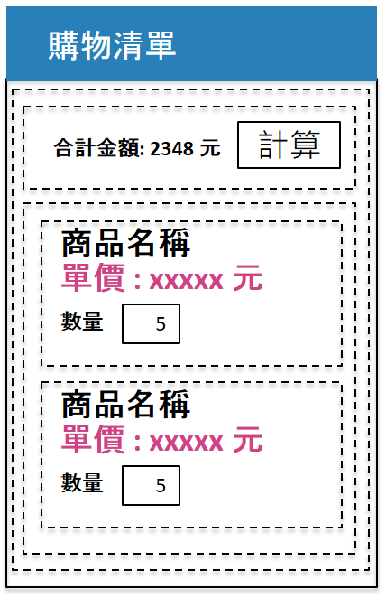

# 挑戰如何抓取 ListView 中內，所輸入的任一項目內的資料，並且可以即時更新統計資訊

在這裡挑戰練習中，我們將需要設計一個頁面，具有購物清單的功能，在這個畫面中，上半部是這個已經加入購物車的物品之合計金額統計，而在下方，則是要購買的商品清單。

在這裡，使用者可以修改要購買商品的數量，並且會即時更新到上方的合計金額中。

挑戰練習過程中，請不要寫任何 Code Behind 程式碼，全程使用 MVVM 方式開發。 

## Commint 1

設計一個按鈕，按下後，就會進行統計，並且顯示出訂購商品總金額

## Commit 2

當修改數量的時候，可以自動直接重新計算總金額

## Commit 3

修正當 Entry 的內容為空白的時候，會造成合計金額異常，因此，設計一個附加屬性，加入到 Entry 上，當 Entry 輸入的內容為空白的時候，將會設定為 0
